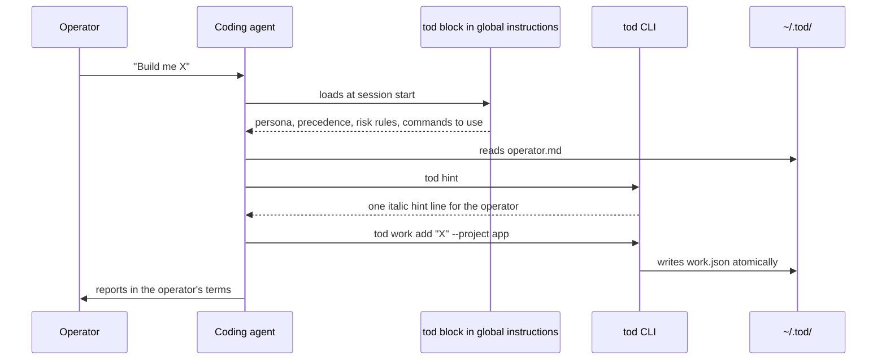
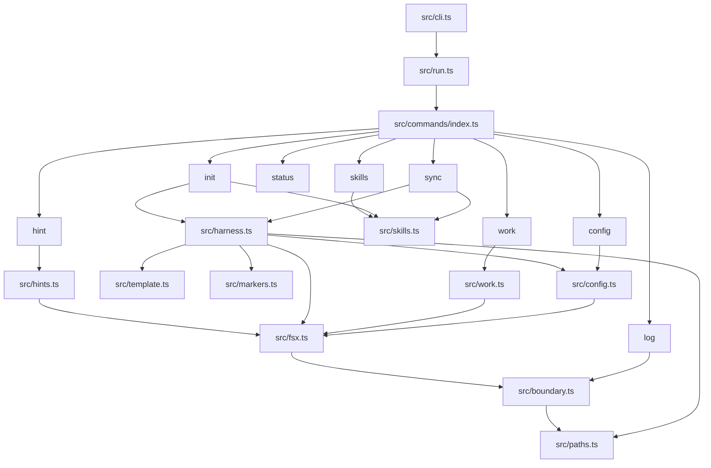
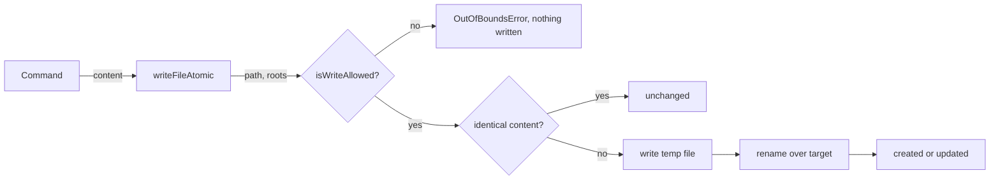

# Architecture

tod has two audiences and one runtime. The operator is a non-technical person building software through a coding agent. The agent is the user of the CLI. The CLI is a Bun TypeScript program, bundled to a single node-target file for npm.

## What tod installs

`tod init` does two things on the operator's machine and nothing else:

1. It appends tod's marker block to each detected agent's global instruction file.
2. It creates `~/.tod/` with four state files.

```
~/.agents/AGENTS.md    # AGENTS.md standard: Codex, opencode, and others
~/.claude/CLAUDE.md    # Claude Code
~/.tod/
  config.json          # two behaviour settings, validated by zod
  operator.md          # prose memory of the operator, edited by agents
  work.json            # projects and work items, edited only through 'tod work'
  log.jsonl            # append-only activity log, edited only through 'tod log'
  hints.json           # cursor for 'tod hint', created on first use rather than by init
```

An agent's instruction file is only touched when its config folder exists. A machine with Claude Code installed but no `~/.agents/` gets one block, not two, and the skipped agent is named in the output.

## Session flow



The block is the operating layer. It is deterministic prose rendered from two settings, and it is short by design: detail that an agent needs on demand lives in CLI help text and in `~/.tod/` files, not in the block.

## Module map



Each module has one job:

1. `src/cli.ts` is the entry point. It passes `process.argv` to `run` and exits with the returned code.
2. `src/run.ts` owns top-level help, the version flag, and routing to a command. Unknown commands exit 2 with a fix line.
3. `src/commands/index.ts` is the command registry. A command is an object with `help` text and an `execute` function that returns an exit code.
4. `src/harness.ts` is the single implementation behind `init` and `sync`. It reads and validates everything first, then writes.
5. `src/template.ts` renders the marker block body from a `Config`.
6. `src/markers.ts` is a pure content transform: given a file's existing content and a block body, it returns the new content with exactly one block.
7. `src/hints.ts` holds the operator hint list and the cursor that cycles through it.
8. `src/skills.ts` lists the published skills, builds the pinned install command, and detects whether each is installed.
9. `src/config.ts` and `src/work.ts` define the zod schemas for `config.json` and `work.json`, and the pure state transitions for work items.
10. `src/fsx.ts` owns `writeFileAtomic`, the only way tod writes a file.
11. `src/boundary.ts` owns the write allowlist and the containment check.
12. `src/paths.ts` derives every path from one home root, and lists the agent targets.
13. `src/output.ts` defines exit codes and the `what`, `why`, `fix` error shape.
14. `src/commands/harness-io.ts` maps tagged errors to agent-facing errors and renders install reports.

## The write pipeline

Every write, with one exception, goes through the same path.



The allowlist is the three roots under the home directory. Containment is checked against the real path after symlink resolution. For a target that does not exist yet, the deepest existing ancestor is resolved and the remaining segments appended, so a symlinked `~/.tod` that points outside the home directory is refused.

The exception is `tod log`. It appends with `appendFileSync` because a temp-file-and-rename would rewrite the whole log and break the append-only guarantee. It still checks `isWriteAllowed` first.

## Two-phase install

`installHarness` in `src/harness.ts` runs `init` and `sync`. It has a strict shape:

1. Read phase. Load and validate config, read each instruction file, compute the upserted content, and decide which seed files are missing.
2. Write phase. Write each computed file through `writeFileAtomic`.

Any expected failure (invalid config, malformed markers, out-of-bounds path) surfaces in the read phase, before anything on disk changes. Seed files that already exist are reported as `unchanged` and never rewritten, because `operator.md`, `work.json`, and `log.jsonl` become operator-owned data the moment they exist.

`init` and `sync` differ in one check: `sync` refuses to run when `~/.tod/` does not exist, so it cannot silently become a first install.

## Home resolution and the sandbox

All paths derive from `resolveHome` in `src/paths.ts`. The `TOD_HOME` environment variable overrides the home directory, and the boundary allowlist derives from the same root, so writes stay confined under the override.

The `sandbox` script in `package.json` sets `TOD_HOME=output`, which is gitignored. Run `bun run sandbox init` to exercise the CLI against a repo-local fake home. Tests use the same mechanism, or a fresh temporary directory passed as `HOME`. No test touches the real home directory.

## Error model

Modules return `Result` from `better-result` at their boundaries and never throw across them. Errors are tagged classes (`OutOfBounds`, `Io`, `Config`, `MalformedMarkers`, `NotInitialised`, `WorkState`, `UnknownWorkItem`). Commands map each tag to an agent-facing error with `what`, `why`, and `fix` lines through `formatError`, and exit 1. Usage mistakes exit 2.

## Build and distribution

`scripts/build.ts` bundles `src/cli.ts` with `Bun.build` for the node target and replaces the shebang so the installed bin resolves node. The published package contains only `dist/`. The version printed by `tod --version` and used by `tod skills` is read from `package.json` at build time.

Skills are not in the npm package. They live in `skills/` in this repository and are installed by the agent from git, pinned to the release tag matching the installed tod version. See [Templates and skills](templates-and-skills.md).
