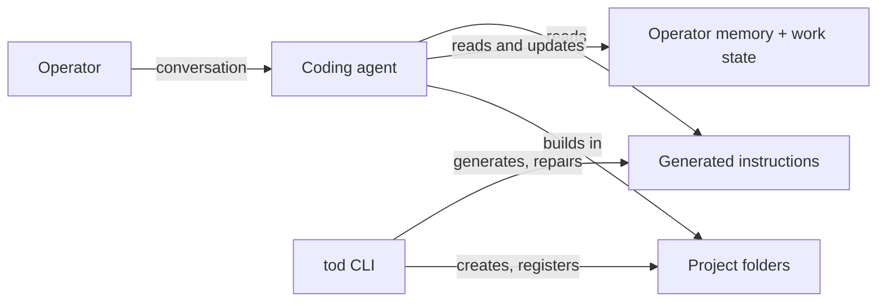

# tod v0.1 Spec

# Summary

tod is an open-source CLI that turns any AGENTS.md-compatible coding agent into a software factory for non-technical builders. It owns the canonical agent instructions, an operator memory, and cross-project work state, all inside a single workspace directory that the operator's agent reads. tod is an operator harness: it has opinions about process (branching, work tracking, how the agent treats the operator) but never writes application code, never scaffolds projects, and never deploys. It guides the existing agent; that is all.

# Context

Coding agents assume their user is a software engineer. They ask engineering questions, make unexplained decisions, leave git repositories in states the user cannot recover from, and forget everything about the user between sessions. A capable product person, founder, or domain expert (the **operator**) can describe what they want built but gets stuck on everything around the code: branching, work tracking, and communicating with an agent that talks past them.

tod adapts the development environment to the operator instead of expecting the operator to become an engineer. The end users are:

1. **Non-technical operators**: product-minded builders with no engineering background, using agents like Codex, Claude Code, or opencode to build real software.
2. **Semi-technical operators**: builders with partial background (for example strong product, weak infrastructure) who need only their gaps filled.
3. **The maintainer**, who dogfoods tod while building it.

tod is developed in the open. All changes to the tod repository go through feature branches and pull requests, even with a single maintainer, and the repository must never contain operator personal data or machine-specific paths.

## At a glance

The operator installs tod, initialises a workspace, and then uses their coding agent exactly as they normally would. The agent picks up tod's generated instructions through the standard AGENTS.md mechanism and behaves as the operator's virtual product team: it onboards the operator in the first session, remembers who they are, communicates at their level, tracks work across projects, and follows an opinionated git workflow.

_Illustrative: file and directory names are indicative, not binding, except AGENTS.md and CLAUDE.md which are fixed by the agents that read them._

```
my-workspace/
  AGENTS.md            # canonical instructions, generated and owned by tod
  CLAUDE.md            # symlink to AGENTS.md, created for Claude Code users
  .tod/
    config.json        # workspace settings, communication configuration
    operator.md        # operator memory: profile, proficiency, preferences
    work/              # orchestrator state: projects, features, tasks, status
  projects/
    my-app/            # an operator project (its own git repo); tod adds
      AGENTS.md        # only instructions, never application code
      CLAUDE.md        # symlink to AGENTS.md
```



## Problem

Four failure modes recur when a non-technical operator works directly with a coding agent:

1. **No harness.** Every session starts cold. The agent does not know the operator's background, terminology, or preferred level of explanation, so it either over-explains or assumes expertise the operator lacks.
2. **Missing capabilities.** The operator cannot supply the product management, engineering management, or architecture judgement the agent expects from its user. Nobody fills the gap, so decisions default to whatever the agent picks in the moment.
3. **No visibility.** Work spreads across sessions and projects with no record. The operator cannot answer "what am I in the middle of?" without re-reading chat histories.
4. **No guardrails.** Agents improvise workflow. Work lands directly on main, features and fixes tangle together, and when the repository ends up in a difficult state the operator has no way to recover.

## Approach

tod is a **config/state harness**, not a launcher. The operator runs their agent as usual; tod maintains the files the agent reads and writes. This keeps tod agent-agnostic by construction: any agent that honours AGENTS.md works without tod changes. Agent-specific code is limited to thin file adapters. For v0.1 the only one needed is a CLAUDE.md symlink for Claude Code, since Codex and opencode read AGENTS.md natively. The adapter layer must allow future agents to be added without restructuring.

tod-managed content is delimited, not whole-file. Where tod creates a file, it owns it outright. Where a file already exists (an operator's own AGENTS.md, a real CLAUDE.md), tod appends a clearly delimited marker block and thereafter edits only inside its own markers, never the surrounding content. Content inside the markers is produced from templates combined with the operator profile and communication configuration, and is regenerated by tod on demand, so drift is always repairable. Two categories of state are deliberately agent-writable, with the rules for writing them embedded in the generated instructions: the operator memory and the work state. Agents are explicitly instructed never to edit tod-managed content by hand.

Two principles run through every command. First, operator-system safety: every filesystem write is checked against an explicit allowlist of roots (tod's user-level directories and operator-designated project folders), with symlinks resolved before the check. tod never deletes or overwrites files it did not create, and all writes are atomic. Second, determinism: routine mutations (registering a project, updating a marker block, appending work state) are CLI commands, not instructions for an agent to interpret. Agents are directed to run tod commands rather than hand-edit tod-managed files; free-form agent writing is reserved for genuinely interpretive content such as operator-memory prose.

The operator-facing capabilities are all rendered into those instructions. Onboarding is agent-led: `tod init` leaves a seed profile, and the instructions direct the agent to run a lightweight onboarding conversation in the operator's first session. Ongoing use refines the profile into operator memory. Communication configuration sets where the agent sits on dimensions such as technical versus non-technical and detailed versus concise. Persona composition reads the profile, determines which disciplines the operator lacks (product management, engineering management, software engineering, architecture), and directs the agent to supply them internally while presenting one coherent interface. The work orchestrator is markdown state plus instruction rules: any session can answer "what is in flight?" and update status, and the tod CLI can report the same view without an agent.

tod's opinions are about process, not technology. v0.1 renders zero tech-stack instructions: no runtime, framework, database, or tooling guidance reaches the agent. tod never scaffolds or modifies application code; that is permanent scope, not deferred scope. Project creation is deliberately thin: `tod new` makes the folder, places project-level instructions, initialises a git repository, and registers the project in work state. The agent can run it on the operator's behalf when a conversation calls for a new project. The generated instructions enforce the git workflow: every feature and bug fix on its own branch, never direct work on main, branches explained to the operator as separate versions of their app.

# Requirements

## Functional Requirements

### Workspace and CLI

1. **FR1.** `tod init` creates a workspace: it generates the canonical workspace instructions, creates agent adapter files, and writes a seed operator profile and empty work state. It asks the operator nothing; onboarding is agent-led (FR9). Existing files are never overwritten: where an AGENTS.md already exists, tod appends its marker block.
2. **FR2.** `tod new` creates a project inside the workspace: a folder with project-level generated instructions and adapter files, an initialised git repository with an initial commit on main, and a registration in work state. It adds no application code and no tech-stack files. It is runnable by the operator directly or by the agent on the operator's behalf.
3. **FR3.** `tod sync` regenerates all generated files from templates and current configuration, and repairs missing or broken adapter symlinks. It is idempotent and never touches operator memory or work state.
4. **FR4.** `tod status` reports work in flight across all projects from the orchestrator state, without requiring an agent session.
5. **FR5.** tod is distributed on npm as the package `tod-ai`, exposing a `tod` binary, installable with npm or bun.

### Agent adapters

6. **FR6.** Canonical instructions live in AGENTS.md at the workspace root and in each project. Any agent that reads AGENTS.md works with no tod changes and no agent-specific configuration.
7. **FR7.** A Claude Code adapter provides CLAUDE.md as a symlink to AGENTS.md at each level. Where a real CLAUDE.md already exists, tod does not replace it; it falls back to appending its marker block there. The adapter layer is structured so additional agent adapters are additive.
8. **FR8.** tod-managed content carries machine-readable markers: whole-file for tod-created files, delimited blocks inside shared files. The instructions direct agents never to edit inside the markers. `tod sync` restores drifted tod-managed content and never modifies content outside its markers.

### Onboarding and operator memory

9. **FR9.** Onboarding is fully agent-led. The generated instructions direct the agent to run a lightweight onboarding conversation in the operator's first session, discovering their background across product management, engineering, architecture, and general technical depth, and identifying capability gaps rather than assigning a predefined persona. The agent records the result in operator memory.
10. **FR10.** Operator memory is a human-readable markdown file, separate from the generated instructions, loaded into agent context via the instructions. Agents are directed to record learned preferences there: technical and product proficiency, terminology, desired explanation depth, and working preferences.
11. **FR11.** Agents may evolve operator memory but must not modify foundational instructions; the instructions state this rule and `tod sync` enforces it mechanically (FR8).

### Communication configuration

12. **FR12.** Communication is configurable along at least these dimensions: technical versus non-technical, detailed versus concise, implementation-focused versus outcome-focused, and chatty versus terse. Settings are captured during agent-led onboarding, changeable at any time, and rendered into the generated instructions.
13. **FR13.** Preferences inferred during normal use are recorded in operator memory and refine communication without requiring explicit reconfiguration.

### Personas

14. **FR14.** tod composes a virtual team from the operator's capability gaps, drawing on product manager, engineering manager, software engineer, and architect roles. A product expert gets an engineering organisation; a technical builder gets only the missing disciplines; a fully non-technical operator gets a whole virtual team.
15. **FR15.** Personas collaborate internally and present one coherent interface. The operator never addresses or manages individual personas.

### Work orchestrator

16. **FR16.** Work state tracks projects, features, tasks, and their status as human-readable markdown in tod's state directory. Agents read and update it according to rules in the generated instructions.
17. **FR17.** In any session, the operator can ask what work is in flight, which tasks are open, and which projects have activity, and the agent answers from work state. `tod status` (FR4) gives the same view.
18. **FR18.** Bulk operations (closing tasks, reviewing outstanding work, reorganising work) are performed conversationally by the agent against the work state.

### Git workflow

19. **FR19.** The generated instructions enforce an opinionated git workflow: every feature and every bug fix gets its own branch, and no direct development on main. Branches are explained to the operator as separate versions of their application.
20. **FR20.** The agent owns git mechanics. Instructions require it to keep the repository out of difficult states and to resolve git problems without operator involvement.

### Deterministic tooling

21. **FR21.** Every routine mutation of tod-managed state (marker-block updates, work-state changes, project registration, log appends) is exposed as a deterministic, idempotent CLI command. The generated instructions direct agents to run these commands instead of hand-editing tod-managed files.

## Non-Functional Requirements

1. **NFR1.** tod is built with Bun, TypeScript, Biome, and bun test. This is tod's own implementation stack and is never rendered into operator-facing instructions.
2. **NFR2.** tod is fully local. No network services, no accounts, no telemetry in v0.1. Operator memory contains personal information and must never end up inside a project repository or anything pushed remotely.
3. **NFR3.** CLI operations are non-destructive by default: `tod sync` never overwrites operator-authored content, tod never deletes or overwrites files it did not create, and writes are atomic so a failed command leaves every file untouched.
4. **NFR4.** Supported platforms are macOS and Linux. Windows is out of scope for v0.1 (the symlink adapter strategy does not translate cleanly).
5. **NFR5.** Generated instructions stay small enough not to crowd agent context windows. Prefer concise rules over exhaustive prose; push detail into state files loaded on demand.
6. **NFR6.** The repository is structured for open source: MIT licensed, documented well enough for a stranger to install and use, and free of personal data and machine-specific paths.
7. **NFR7.** Every filesystem write resolves symlinks and must land inside an explicit allowlist of roots: tod's user-level directories and operator-designated project directories. Out-of-boundary targets are refused with an error naming the boundary.
8. **NFR8.** The CLI is agent-facing: non-interactive, stable exit codes, help text that states when to use each command, and errors that state what failed, why, and the exact next action.

## Non-goals

1. Deployment. tod never manages deployments. Permanent scope, not deferred scope.
2. Scaffolding and application code. tod never creates or modifies application code; it guides the agent that does. Permanent scope.
3. Tech-stack instructions. v0.1 renders no opinions about runtimes, frameworks, databases, or tooling into agent instructions. This may be revisited in later versions.
4. Launcher or wrapper mode. tod does not spawn or supervise agent processes in v0.1.
5. Agent-specific features beyond file adapters. No Claude Code skills, subagents, or hooks in v0.1.
6. Hosted service, multi-operator workspaces, or team features.
7. Windows support.
8. Databases or structured storage for tod's own state. Markdown and JSON files only in v0.1.

# Acceptance Criteria

1. [ ] **AC1.** On a machine without tod: install `tod-ai`, run `tod init`. The workspace contains generated AGENTS.md, a valid CLAUDE.md symlink, a seed operator profile, and empty work state. (FR1, FR5, FR6, FR7)
2. [ ] **AC2.** Open the fresh workspace in an AGENTS.md-reading agent. Unprompted, the agent runs the onboarding conversation and records the operator's background and capability gaps in operator memory. (FR9, FR10)
3. [ ] **AC3.** Run `tod new` (or ask the agent to start a project). The project folder contains generated instructions with adapter symlink and is a git repository with an initial commit on main, is registered in work state, and contains zero application or tech-stack files. (FR2, FR16)
4. [ ] **AC4.** Open the workspace in a second AGENTS.md-reading agent with zero agent-specific setup. It adopts the tod instructions: it acts as the operator's team and consults work state when asked about work. (FR6, FR15, FR17)
5. [ ] **AC5.** Tell the agent a working preference (for example "stop showing me code"). Operator memory is updated, and a fresh session honours the preference without being told again. (FR10, FR13)
6. [ ] **AC6.** Start a feature through agent conversation. Work state gains the feature and its tasks; both `tod status` and a brand-new agent session report it as in flight. (FR4, FR16, FR17)
7. [ ] **AC7.** Ask the agent for a change in a project. The work lands on a new branch, not on main. (FR19, FR20)
8. [ ] **AC8.** Delete the CLAUDE.md symlink and hand-edit the generated AGENTS.md. `tod sync` restores both while leaving operator memory and work state untouched. (FR3, FR8, NFR3)
9. [ ] **AC9.** With a fully non-technical operator profile, the agent supplies product and engineering judgement itself rather than asking the operator engineering questions, and communicates according to the configured dimensions. (FR12, FR14, FR15)
10. [ ] **AC10.** The tod repository passes its own checks (typecheck, Biome, tests) and contains no operator personal data or machine-specific paths. (NFR1, NFR6)
11. [ ] **AC11.** Run `tod init` where an AGENTS.md with operator content already exists. tod appends its marker block and the pre-existing content is byte-identical. A write targeting a path outside the allowlist is refused with an error naming the boundary. (FR1, FR8, NFR7)

# References

1. [AGENTS.md](https://agents.md): the cross-agent instruction file convention the adapter strategy relies on.
2. Repository licence: MIT (see LICENSE).

# Open Questions

None. All open flags are resolved. Remaining choices (state file formats inside `.tod/`, instruction template wording, CLI argument details) are implementer degrees of freedom.
