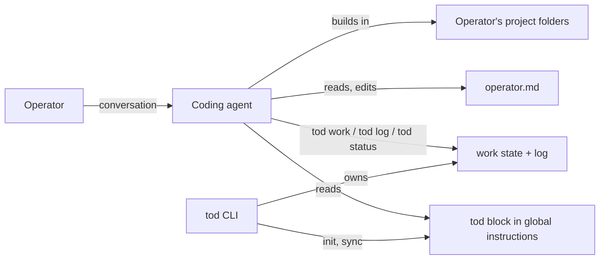

# tod v0.1 Spec

# Summary

tod is an open-source CLI that turns any AGENTS.md-compatible coding agent into a software factory for non-technical builders. It installs an operator harness at the user level: a delimited instruction block inside the agent's own global instruction file, plus operator memory, work state, and an activity log in `~/.tod/`. tod is an operator harness: it has opinions about process (branching, work tracking, how the agent treats the operator) but never writes application code, never scaffolds projects, and never deploys. It guides the existing agent; that is all.

# Context

Coding agents assume their user is a software engineer. They ask engineering questions, make unexplained decisions, leave git repositories in states the user cannot recover from, and forget everything about the user between sessions. A capable product person, founder, or domain expert (the **operator**) can describe what they want built but gets stuck on everything around the code: branching, work tracking, and communicating with an agent that talks past them.

tod adapts the development environment to the operator instead of expecting the operator to become an engineer. The end users are:

1. **Non-technical operators**: product-minded builders with no engineering background, using agents like Codex, Claude Code, or opencode to build real software.
2. **Semi-technical operators**: builders with partial background (for example strong product, weak infrastructure) who need only their gaps filled.
3. **The maintainer**, who dogfoods tod while building it.

tod is developed in the open. All changes to the tod repository go through feature branches and pull requests, even with a single maintainer, and the repository must never contain operator personal data or machine-specific paths.

## At a glance

The operator's coding agent installed tod, so the agent-harness config folders already exist 99 times out of 100. `tod init` appends tod's delimited instruction block to each agent's global instruction file and creates `~/.tod/` for state. From then on every agent session, in any folder, carries the harness: it onboards the operator in the first session, remembers who they are, communicates at their level, tracks work across projects through tod's CLI, and follows an opinionated git workflow. tod places nothing inside the operator's project folders.

_Illustrative: state file names are indicative, not binding. The instruction file paths are fixed by the agents that read them._

```
~/.agents/AGENTS.md    # cross-agent standard; tod appends its marker block
~/.claude/CLAUDE.md    # Claude Code; tod appends its marker block
~/.tod/
  config.json          # settings, communication configuration
  operator.md          # operator memory: profile, proficiency, preferences
  work.json            # work state: projects, features, tasks (CLI-mutated)
  log.jsonl            # append-only activity log (CLI-mutated)
```



## Problem

Four failure modes recur when a non-technical operator works directly with a coding agent:

1. **No harness.** Every session starts cold. The agent does not know the operator's background, terminology, or preferred level of explanation, so it either over-explains or assumes expertise the operator lacks.
2. **Missing capabilities.** The operator cannot supply the product management, engineering management, or architecture judgement the agent expects from its user. Nobody fills the gap, so decisions default to whatever the agent picks in the moment.
3. **No visibility.** Work spreads across sessions and projects with no record. The operator cannot answer "what am I in the middle of?" without re-reading chat histories.
4. **No guardrails.** Agents improvise workflow. Work lands directly on main, features and fixes tangle together, and when the repository ends up in a difficult state the operator has no way to recover.

## Approach

tod is a **config/state harness**, not a launcher. The operator runs their agent as usual; tod maintains the files the agent reads and the state the agent updates through tod's CLI. Integration is at the user level: agents load global instructions from their harness config folders (`~/.agents/AGENTS.md` for the cross-agent standard, `~/.claude/CLAUDE.md` for Claude Code), so the harness reaches every session regardless of which folder it starts in. Project folders belong to the operator and their agent; tod never writes into them. Agent-specific code is limited to knowing each agent's global instruction file path; adding an agent is additive.

tod-managed content is delimited, not whole-file. In each global instruction file, tod owns exactly one clearly delimited marker block: appended if absent, rewritten only between its markers, with surrounding operator or agent content never touched. Block content is rendered from templates combined with the operator profile and communication configuration, and is regenerated by `tod sync` on demand, so drift is always repairable. Agents are instructed never to edit tod-managed content by hand.

Two principles run through every command. First, operator-system safety: every filesystem write is checked against an explicit allowlist of roots (`~/.agents/`, `~/.claude/`, `~/.tod/`), with symlinks resolved before the check. tod never deletes or overwrites files it did not create, and all writes are atomic. Second, determinism: routine mutations (recording work, appending the log, changing configuration, updating marker blocks) are CLI commands, not instructions for an agent to interpret. Agents are directed to run tod commands rather than hand-edit tod-managed files; free-form agent writing is reserved for genuinely interpretive content, which in v0.1 is exactly one file: the operator memory.

The operator-facing capabilities are all rendered into the instruction block. Onboarding is agent-led: `tod init` seeds an empty profile, and the block directs the agent to run a lightweight onboarding conversation in the operator's first session. Ongoing use refines the profile into operator memory. Communication configuration sets where the agent sits on dimensions such as technical versus non-technical and detailed versus concise. Persona composition reads the profile, determines which disciplines the operator lacks (product management, engineering management, software engineering, architecture), and directs the agent to supply them internally while presenting one coherent interface. The work orchestrator is CLI-owned state plus instruction rules: agents record features and tasks with `tod work`, note events with `tod log`, and any session or `tod status` can answer "what is in flight?". The git workflow is enforced by the block: every feature and bug fix on its own branch, never direct work on main, branches explained to the operator as separate versions of their app.

# Requirements

## Functional Requirements

### CLI and distribution

1. **FR1.** `tod init` sets up the harness: it creates `~/.tod/` with configuration, a seed operator profile, empty work state, and an empty log, and appends tod's instruction block to each detected agent's global instruction file. Detection means the agent's config folder exists; the instruction file is created when missing. Existing file content is never modified outside tod's block. Idempotent: re-running repairs rather than duplicates.
2. **FR2.** `tod sync` re-renders tod's instruction blocks from current configuration and repairs `~/.tod/` structure. It never modifies content outside tod's markers and never touches operator memory, work state, or the log. Idempotent.
3. **FR3.** `tod status` reports work in flight across all tracked projects, without requiring an agent session.
4. **FR4.** `tod work` provides deterministic subcommands to record and update work: add features and tasks under a named project, update status, and complete items. Agents use these commands; they never hand-edit work state.
5. **FR5.** `tod log` appends timestamped entries to the activity log. The log is append-only; no command rewrites history.
6. **FR6.** `tod config` reads and updates settings, including the communication dimensions. Settings changes take effect in instruction blocks via `tod sync`.
7. **FR7.** tod is distributed on npm as the package `tod-ai`, exposing a `tod` binary, installable with npm or bun.

### Agent integration

8. **FR8.** Integration targets each agent's global instruction file: `~/.agents/AGENTS.md` for AGENTS.md-standard agents and `~/.claude/CLAUDE.md` for Claude Code. The adapter layer is a per-agent target path; additional agents are additive. tod writes nothing into project folders.
9. **FR9.** tod-managed content in shared files is a single delimited marker block with machine-readable markers. The block directs agents never to edit inside the markers. `tod sync` restores a drifted block and never modifies content outside it.

### Onboarding and operator memory

10. **FR10.** Onboarding is fully agent-led. The instruction block directs the agent to run a lightweight onboarding conversation in the operator's first session, discovering their background across product management, engineering, architecture, and general technical depth, and identifying capability gaps rather than assigning a predefined persona. The agent records the result in operator memory.
11. **FR11.** Operator memory is a human-readable markdown file in `~/.tod/`, separate from the instruction blocks, loaded into agent context via the block's rules. Agents are directed to record learned preferences there: technical and product proficiency, terminology, desired explanation depth, and working preferences. It is the only tod-managed file agents edit directly.
12. **FR12.** Agents may evolve operator memory but must not modify foundational instructions; the block states this rule and `tod sync` enforces it mechanically (FR9).

### Communication configuration

13. **FR13.** Communication is configurable along at least these dimensions: technical versus non-technical, detailed versus concise, implementation-focused versus outcome-focused, and chatty versus terse. Settings are captured during agent-led onboarding via `tod config`, changeable at any time, and rendered into the instruction blocks.
14. **FR14.** Preferences inferred during normal use are recorded in operator memory and refine communication without requiring explicit reconfiguration.

### Personas

15. **FR15.** tod composes a virtual team from the operator's capability gaps, drawing on product manager, engineering manager, software engineer, and architect roles. A product expert gets an engineering organisation; a technical builder gets only the missing disciplines; a fully non-technical operator gets a whole virtual team.
16. **FR16.** Personas collaborate internally and present one coherent interface. The operator never addresses or manages individual personas.

### Work orchestrator

17. **FR17.** Work state tracks projects, features, tasks, and their status in `~/.tod/`, mutated only through `tod work` and readable by agents and `tod status`. Projects enter work state the first time work is recorded against them; there is no separate registration step.
18. **FR18.** In any session, the operator can ask what work is in flight, which tasks are open, and which projects have activity, and the agent answers from work state. `tod status` (FR3) gives the same view.
19. **FR19.** Bulk operations (closing tasks, reviewing outstanding work, reorganising work) are performed conversationally by the agent, executed through `tod work` commands.

### Git workflow

20. **FR20.** The instruction block enforces an opinionated git workflow: every feature and every bug fix gets its own branch, and no direct development on main. Branches are explained to the operator as separate versions of their application.
21. **FR21.** The agent owns git mechanics. The block requires it to keep repositories out of difficult states and to resolve git problems without operator involvement.

### Deterministic tooling

22. **FR22.** Every routine mutation of tod-managed state (marker blocks, work state, log, configuration) is exposed as a deterministic, idempotent CLI command. The instruction block directs agents to run these commands instead of hand-editing tod-managed files.

## Non-Functional Requirements

1. **NFR1.** tod is built with Bun, TypeScript, Biome, and bun test. This is tod's own implementation stack and is never rendered into operator-facing instructions.
2. **NFR2.** tod is fully local. No network services, no accounts, no telemetry in v0.1. Operator memory contains personal information and must never end up inside a project repository or anything pushed remotely.
3. **NFR3.** CLI operations are non-destructive by default: tod never deletes or overwrites files it did not create, never modifies content outside its markers, and writes atomically so a failed command leaves every file untouched.
4. **NFR4.** Supported platforms are macOS and Linux. Windows is out of scope for v0.1.
5. **NFR5.** The instruction block stays small enough not to crowd agent context windows. Prefer concise rules over exhaustive prose; push detail into state files and CLI output loaded on demand.
6. **NFR6.** The repository is structured for open source: MIT licensed, documented well enough for a stranger to install and use, and free of personal data and machine-specific paths.
7. **NFR7.** Every filesystem write resolves symlinks and must land inside the allowlist: `~/.agents/`, `~/.claude/`, and `~/.tod/`. Out-of-boundary targets are refused with an error naming the boundary.
8. **NFR8.** The CLI is agent-facing: non-interactive, stable exit codes, help text that states when to use each command, and errors that state what failed, why, and the exact next action. On unexpected state (missing marker, malformed file), commands stop, change nothing, and report.

## Non-goals

1. Deployment. tod never manages deployments. Permanent scope, not deferred scope.
2. Scaffolding and application code. tod never creates or modifies application code; it guides the agent that does. Permanent scope.
3. Project-level files and commands. tod writes nothing into project folders and has no per-project commands; projects exist only as names in work state.
4. Tech-stack instructions. v0.1 renders no opinions about runtimes, frameworks, databases, or tooling into agent instructions. This may be revisited in later versions.
5. Launcher or wrapper mode. tod does not spawn or supervise agent processes in v0.1.
6. Agent-specific features beyond instruction-file targets. No Claude Code skills, subagents, or hooks in v0.1.
7. Hosted service, multi-operator setups, or team features.
8. Windows support.
9. Databases or structured storage beyond JSON and markdown files for tod's own state.

# Acceptance Criteria

1. [ ] **AC1.** On a machine with existing `~/.agents/` and `~/.claude/` folders whose instruction files contain operator content: install `tod-ai`, run `tod init`. `~/.tod/` exists with config, seed operator profile, empty work state, and empty log; both instruction files gained tod's marker block; all pre-existing content is byte-identical. Re-running `tod init` changes nothing. (FR1, FR8, FR9)
2. [ ] **AC2.** Open a fresh session in any folder with an AGENTS.md-reading agent. Unprompted, the agent runs the onboarding conversation and records the operator's background and capability gaps in operator memory. (FR10, FR11)
3. [ ] **AC3.** Open a session with a second agent with zero agent-specific setup. It adopts the harness: acts as the operator's team and consults work state when asked about work. (FR8, FR16, FR18)
4. [ ] **AC4.** Tell the agent a working preference (for example "stop showing me code"). Operator memory is updated, and a fresh session honours the preference without being told again. (FR11, FR14)
5. [ ] **AC5.** Start a feature through agent conversation. The agent records it via `tod work`; both `tod status` and a brand-new agent session report it as in flight. (FR3, FR4, FR17, FR18)
6. [ ] **AC6.** Ask the agent for a change in a project. The work lands on a new branch, not on main. (FR20, FR21)
7. [ ] **AC7.** Hand-edit inside tod's marker block and delete a `~/.tod/` structural file. `tod sync` restores the block and structure while leaving operator memory, work state, log, and all content outside the markers untouched. (FR2, FR9, NFR3)
8. [ ] **AC8.** With a fully non-technical operator profile, the agent supplies product and engineering judgement itself rather than asking the operator engineering questions, and communicates according to the configured dimensions. (FR13, FR15, FR16)
9. [ ] **AC9.** `tod work` and `tod log` mutations are atomic and idempotent; on a malformed state file the command stops, changes nothing, and reports a fix. A write targeting a path outside the allowlist is refused with an error naming the boundary. (FR4, FR5, FR22, NFR3, NFR7, NFR8)
10. [ ] **AC10.** The tod repository passes its own checks (typecheck, Biome, tests) and contains no operator personal data or machine-specific paths. (NFR1, NFR6)

# References

1. [AGENTS.md](https://agents.md): the cross-agent instruction file convention the integration relies on.
2. [agents.md issue #91](https://github.com/agentsmd/agents.md/issues/91): the `~/.agents/AGENTS.md` user-level standard path.
3. Repository licence: MIT (see LICENSE).

# Open Questions

None. All open flags are resolved. Remaining choices (state file schemas inside `~/.tod/`, instruction template wording, CLI argument details) are implementer degrees of freedom.
