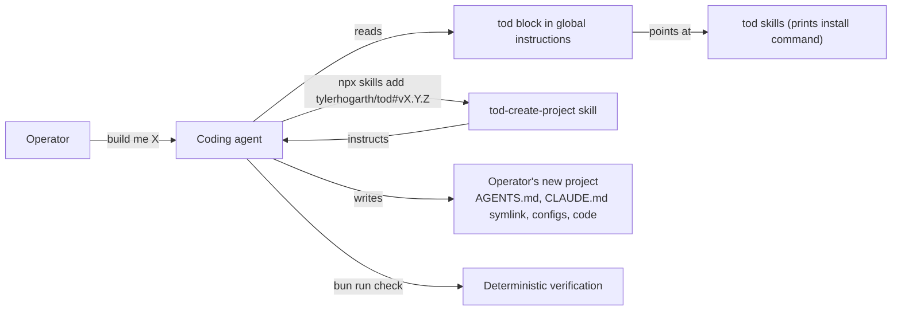

# tod v0.2 Spec: Paved Road and Agent Verification Guardrails

# Summary

tod v0.2 gives coding agents a strongly recommended engineering paved road for the software they build for operators. The paved road is delivered as an installable agent skill published from the tod repository, not as behaviour in the tod CLI. tod still writes nothing into project folders: the skill instructs the agent, and the agent does the writing.

The goal is to remove repeated technical decision-making from agents, raise the reliability of agent-generated software, and give agents deterministic mechanisms for validating their own work.

These defaults are recommendations, not constraints. An operator can leave the paved road deliberately, and the agent follows them.

# Context

v0.1 established the operator harness: who the operator is, how the agent talks to them, how work is tracked, and a safe git workflow. It says nothing about how the software itself is built. Every agent therefore re-decides the same questions on every project: which test runner, which linter, how strict the compiler is, whether tests are written at all, and what "done" means.

Those decisions are worth making once. More importantly, most of them are better enforced by tooling than by instruction. An agent that is told "never introduce unsafe TypeScript" will sometimes comply. An agent whose project fails a compiler check has no choice.

The end users are unchanged from v0.1: non-technical and semi-technical operators building real software through a coding agent, plus the maintainer who dogfoods tod.

## At a glance

The operator asks their agent to build something new. The agent already carries the tod harness from v0.1. The harness points it at `tod skills`, which prints the exact command to install tod's skills at the tag matching the installed tod version. The agent installs the skill and follows it: it asks what the operator wants to build, scaffolds the project on the paved road, writes a project instruction file into the new project, and verifies its own work before reporting back.

The tod CLI's write boundary is unchanged. tod writes only inside `~/.agents/`, `~/.claude/`, and `~/.tod/`. `tod skills` prints a command; it installs nothing and writes nothing.

## Problem

Four failure modes recur when an agent builds software for a non-technical operator:

1. **Repeated decisions.** Every project re-litigates runtime, framework, test runner, and lint tooling. The operator cannot referee these choices, so they default to whatever the agent picks that day.
2. **Unverifiable work.** Agents declare work complete without running anything. The operator, who cannot read code, has no way to tell working software from plausible-looking software.
3. **Rules that do not bind.** Engineering standards written as prose in an instruction file are advisory. Agents follow them unevenly and the file grows until it crowds out the instructions that matter.
4. **Accumulated drift.** Repeated agent iterations leave dead code, orphaned files, and unused dependencies behind, and nothing removes them.

## Approach

Four principles shape v0.2.

**Instructions define workflow; tooling enforces invariants.** Anything a compiler, linter, test, or script can check is pushed into project configuration rather than into prose. The instruction surface stays short and covers intent, workflow, commands, and when to involve the operator. This is the central design rule, and it is why the paved road ships as scaffolding rather than as more text in the global block.

**tod recommends, the agent installs.** The skill names the tools and the invariants. It does not carry install commands, version pins, or command transcripts, because those go stale on every upstream release and the agent can determine current install steps itself. tod itself installs nothing and writes nothing into project folders.

**Verification is part of implementation, not a separate step.** Every scaffolded project exposes two deterministic commands. `bun run check` is the fast loop an agent runs constantly. `bun run check:full` is the complete gate. An agent that has not run verification has not finished.

**The paved road is a default, not a fence.** When an operator asks for something off the road, the agent says so once in plain language, explains the consequence, follows the operator, and records the decision in the project instruction file so no later session re-argues it.

### Delivery mechanism

The paved road is one skill, `tod-create-project`, stored in the tod repository under `skills/`. Distribution is the open skills ecosystem: `npx skills add tylerhogarth/tod#<ref>` resolves a git ref, so pinning to a release tag is a documented, verified capability of the tooling rather than something tod implements.

The ref is the tag matching the installed tod version. An agent that installs `tod-ai@0.2.0` gets the skill from tag `v0.2.0`, so skill and CLI never disagree. This makes tagging every release a hard requirement; the tag-triggered release workflow already exists and has never been exercised.

`tod skills` exists so the agent never has to construct that tag string itself. It prints the exact command with tod's own version substituted. Printing is the whole feature.

# Requirements

## Functional Requirements

### Skill distribution

1. **FR1.** The tod repository contains one skill, `tod-create-project`, under `skills/`, discoverable and installable by the open skills tooling.
2. **FR2.** `tod skills` prints the exact install command for the running tod version, pinned to the matching git tag. It performs no network access, no installation, and no filesystem write.
3. **FR3.** Every published tod release carries a matching `v<version>` git tag, so the pinned install resolves.
4. **FR4.** tod's global instruction block points the agent at `tod skills` when the operator starts something new. The pointer costs a small, fixed number of lines; paved-road detail lives in the skill, not the block.

### The skill

5. **FR5.** The skill directs the agent through creating a new project: understand what the operator wants, scaffold on the paved road, write project instructions, verify, and report in operator-facing terms.
6. **FR6.** The skill carries one template for the project instruction file, written into the new project as `AGENTS.md` with `CLAUDE.md` symlinked to it, so every agent family reads the same file.
7. **FR7.** The skill states the recommended stack and the invariants it requires. It does not carry install commands or version pins; the agent determines current installation steps.
8. **FR8.** The skill instructs the agent to record any operator departure from the paved road in the project `AGENTS.md`, with the reason.

### The paved road

9. **FR9.** Recommended stack: Bun runtime, TypeScript, React with Vite for frontend, PostgreSQL, Prisma as the data access layer, Zod for boundary validation, better-result for typed expected failures, Vitest for unit and integration tests, React Testing Library for component behaviour, Playwright for a small number of end-to-end flows, Biome for formatting and static analysis, Knip for dead-code and unused-dependency analysis.
10. **FR10.** Local development uses a local Prisma Postgres server. Prisma's managed cloud offering is an operator opt-in, never a default. tod recommends no deployment target in v0.2.
11. **FR11.** Every scaffolded project exposes `bun run check` covering type checking, static analysis, and tests, and `bun run check:full` additionally covering the production build, end-to-end tests, and dead-code analysis.
12. **FR12.** TypeScript configuration enables at minimum `strict`, `noUncheckedIndexedAccess`, and `exactOptionalPropertyTypes`. Weakening the configuration to silence an error is disallowed; the underlying typing or design issue is corrected instead.
13. **FR13.** Biome configuration discourages unjustified escapes from the type system, including explicit `any` and non-null assertions.
14. **FR14.** New application logic carries tests that validate behaviour rather than implementation detail. Verification is part of completing implementation, not an optional follow-up.
15. **FR15.** The skill states a dependency preference order: existing application primitives, then standard language capabilities, then Bun built-ins, then framework primitives, then dependencies already present, then a new third-party dependency, then a bespoke implementation. Foundational libraries that improve correctness, type safety, validation, security, or verification are not rejected merely for being dependencies.

### tod's own repository

16. **FR16.** The tod repository adopts the applicable subset of the paved road: the strict TypeScript flags, hardened Biome rules, the `check` and `check:full` split, and Knip.
17. **FR17.** tod keeps its existing test runner. It is a Bun CLI where the native runner is the correct tool, and the exception is documented in the repository instruction file with its reason.

## Non-Functional Requirements

1. **NFR1.** The tod CLI's write boundary is unchanged. No v0.2 command writes outside `~/.agents/`, `~/.claude/`, and `~/.tod/`, and no v0.2 command writes into a project folder.
2. **NFR2.** The skill body stays within the progressive-disclosure budget: frontmatter for routing, a body an agent can act on without loading anything else, and detail in reference files loaded on demand.
3. **NFR3.** The addition to tod's global instruction block keeps the block within its existing size budget.
4. **NFR4.** The skill contains no absolute paths, no operator data, and no machine-specific paths.
5. **NFR5.** The skill's instructions are agent-agnostic: no tool names specific to one agent harness, and no assumption about which agent is running.

# Acceptance Criteria

1. **AC1.** A coding agent with tod installed, given "build me something new", finds the skill through `tod skills`, installs it pinned to the matching tag, and follows it without further operator input on engineering choices.
2. **AC2.** A project scaffolded through the skill has a project `AGENTS.md`, a `CLAUDE.md` symlink pointing at it, strict TypeScript, hardened Biome rules, and working `check` and `check:full` commands.
3. **AC3.** `bun run check` fails on unsafe TypeScript, a lint violation, and a failing test, and the agent responds to the failure rather than reporting the work complete.
4. **AC4.** An operator request that departs from the paved road is acknowledged once in plain language, followed, and recorded in the project `AGENTS.md`.
5. **AC5.** `tod skills` prints a command whose tag matches the installed tod version, and that command resolves against the published repository.
6. **AC6.** The tod CLI writes nothing into any project folder; the boundary tests still pass unchanged.
7. **AC7.** The tod repository passes its own `check` and `check:full`.

# Out of Scope

1. Deployment targets and hosting recommendations. v0.2 covers tooling only.
2. tod scaffolding projects itself. The agent does all project writing.
3. Additional skills beyond `tod-create-project`. Later skills can follow the same distribution mechanism.
4. Version pinning of the recommended stack. The agent installs current versions.
5. Migrating tod's existing tests to a different runner.
